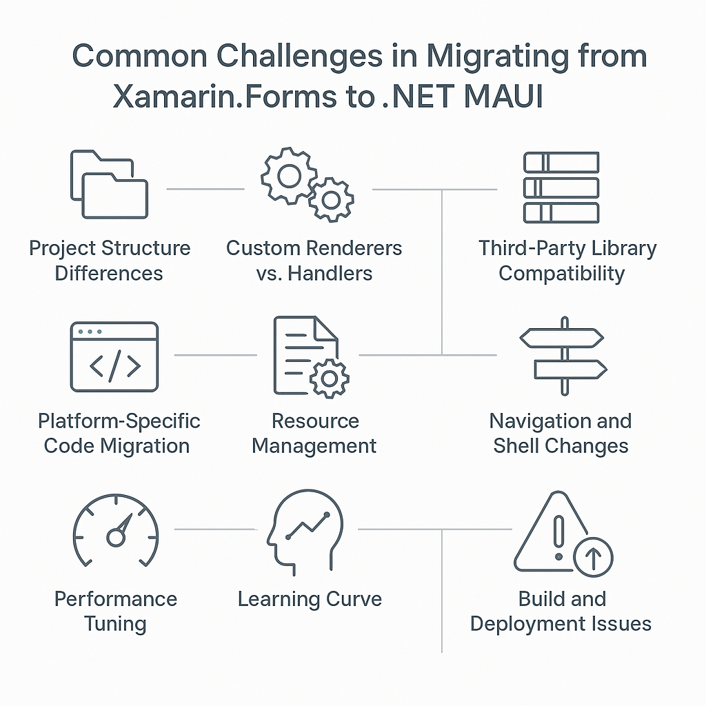

 
 # Rethinking Architecture Through Xamarin to MAUI Migration Challenges

 Migrating from **Xamarin.Forms** to **.NET MAUI (Multi-platform App UI)** marks a pivotal shift in cross-platform mobile development. As [Xamarin reaches its end of support](https://dotnet.microsoft.com/en-us/platform/support/policy/xamarin), MAUI emerges as its modern successor, offering a unified project structure, enhanced performance, and native access across Android, iOS, macOS, and Windows. 

This guide is designed to support developers through the migration journey by highlighting: 

* **Common Challenges:** From architectural shifts to third-party library compatibility, we explore the hurdles you may face and how to overcome them. 
* **Common Changes:** While each project is different from another, there are some common changes noticed in all migration processes. 

Whether you're planning a full-scale migration or just exploring MAUI’s capabilities, this guide will equip you with the insights and tools needed to modernize your app with confidence.

## **🧩Common Challenges**
Migrating can be rewarding, but it comes with several common challenges that developers should be aware of. 

Here's a breakdown of the most frequent issues and how to address them. From architectural shifts to third-party library compatibility, we explore the hurdles you may face and how to overcome them.: 

**1. Project Structure Differences**

* **Challenge:** Xamarin uses multiple platform-specific projects; MAUI uses a single project with platform folders. 
* **Solution:** Learn the new structure and move platform-specific code to the appropriate Platforms folder. 

**2. Custom Renderers vs. Handlers**

* **Challenge:** Xamarin.Forms uses custom renderers; MAUI uses a new handler architecture. 
* **Solution:** Refactor custom renderers into Handlers using the new pattern. This may require rewriting platform-specific logic. 

3. Third-Party Library Compatibility 

Challenge: Some Xamarin-compatible libraries may not yet support MAUI. 
Solution: Check for MAUI-compatible versions or alternatives. Consider replacing unsupported libraries with native MAUI features. 

**4. API Changes and Deprecations**

* **Challenge:** Certain Xamarin APIs are deprecated or changed in MAUI. 
* **Solution:** Refer to the official migration guide and update your code accordingly. 

**5. Resource Management**

* **Challenge:** MAUI uses a new Resources folder for fonts, images, styles, etc. 
* **Solution:** Move and reconfigure resources in the new folder structure. Update references in XAML and code-behind. 

**6. Navigation and Shell Changes**

* **Challenge:** Navigation patterns may differ slightly, especially with Shell. 
* **Solution:** Review and update navigation logic to align with MAUI’s Shell and routing system. 

**7. Platform-Specific Code Migration**

* **Challenge:** Xamarin uses DependencyService and platform-specific projects. 
* **Solution:** Use partial classes, platform folders, or dependency injection in MauiProgram.cs. 

**8. Build and Deployment Issues**

* **Challenge:** CI/CD pipelines and build configurations may break. 
* **Solution:** Update build scripts, pipelines, and ensure MAUI workloads are installed on build agents.
 [

**9. Performance Tuning**

* **Challenge:** Performance may differ due to architectural changes. 
* **Solution:** Profile and optimize using tools like Visual Studio Profiler and MAUI-specific performance tips. 

**10. Learning Curve**

* **Challenge:** Developers need to learn new patterns, tools, and best practices. 
* **Solution:** Invest time in training, tutorials, and community resources.

## **🔄Common Changes**
Here are some common changes you'll encounter when migrating from Xamarin.Forms to .NET MAUI:

**1. Project Structure**

* **Xamarin.Forms:** Multiple platform-specific projects. 
* **MAUI:** Single project with platform folders (Platforms/Android, Platforms/iOS, etc.). 

**2. Startup Configuration**

* **Xamarin.Forms:** App.xaml.cs and platform-specific MainActivity, AppDelegate. 
* **MAUI:** Centralized in MauiProgram.cs using CreateMauiApp(). 

**3. Custom Renderers → Handlers**

* **Xamarin.Forms:** Uses CustomRenderers for platform-specific UI. 
* **MAUI:** Uses Handlers, which are more lightweight and performant. 

**4. Resource Management**

* **Xamarin.Forms:** Resources scattered across projects. 
* **MAUI:** Unified Resources folder for fonts, images, styles, etc. 

**5. Dependency Injection** 

* **Xamarin.Forms:** Manual DI or DependencyService. 
* **MAUI:** Built-in support via Microsoft.Extensions.DependencyInjection. 

**6. Navigation**

* **Xamarin.Forms:** Manual navigation or Shell. 
* **MAUI:** Enhanced Shell navigation with route registration in AppShell.xaml. 

**7. Platform-Specific Code**

* **Xamarin.Forms:** Uses DependencyService and platform projects. 
* **MAUI:** Uses partial classes or platform folders with conditional compilation. 

**8. Third-Party Libraries**

* Many libraries need to be updated or replaced with MAUI-compatible versions. 

**9. UI Controls and APIs**

* Some controls and APIs have been **renamed, deprecated, or replaced.**
* **Example:** ImageSource.FromResource → ImageSource.FromFile or FromStream. 

**10. Build and Deployment**

* MAUI uses .NET CLI and new workloads. 
* Update CI/CD pipelines to support MAUI SDK and workloads.
---
Written by [Akshay Kulkarni](https://github.com/ak47akshaykulkarni), .NET MAUI Developer